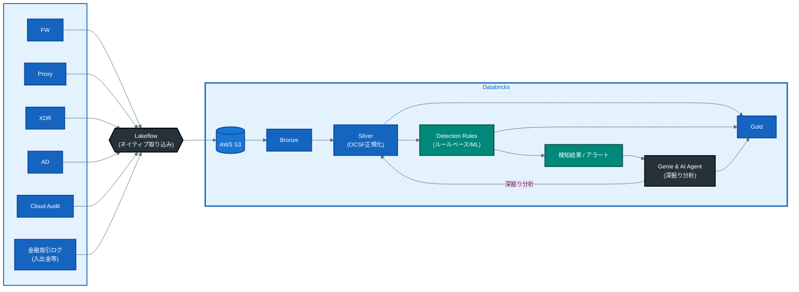

# Databricksネイティブな包括的セキュリティ・不正検知フロー

```mermaid
%%{init: {'theme': 'base', 'themeVariables': {'fontSize': '13px', 'lineColor': '#546E7A'}}}%%
flowchart LR
    %% ── データソース（左カラム） ──
    subgraph sources[" "]
        direction TB
        FW["FW"]
        Proxy["Proxy"]
        XDR["XDR"]
        AD["AD"]
        CloudAudit["Cloud Audit"]
        FinLogs["金融取引ログ<br/>(入出金等)"]
    end

    %% ── 取り込み層 ──
    Lakeflow{{"Lakeflow<br/>(ネイティブ取り込み)"}}

    %% ── Databricks 環境 ──
    subgraph databricks["Databricks"]
        direction TB

        S3[("AWS S3")]
        Bronze["Bronze"]
        Silver["Silver<br/>(OCSF正規化)"]
        DetectionRules["Detection Rules<br/>(ルールベース/ML)"]
        Alerts["検知結果 / アラート"]
        GenieAgent["Genie & AI Agent<br/>(深掘り分析)"]
        Gold["Gold"]

        S3 --> Bronze
        Bronze --> Silver
        Silver --> DetectionRules
        Silver --> Gold
        DetectionRules --> Alerts
        DetectionRules --> Gold
        Alerts --> GenieAgent
        GenieAgent -->|"深掘り分析"| Silver
        GenieAgent --> Gold
    end

    %% ── ソース → Lakeflow → Databricks ──
    FW --> Lakeflow
    Proxy --> Lakeflow
    XDR --> Lakeflow
    AD --> Lakeflow
    CloudAudit --> Lakeflow
    FinLogs --> Lakeflow
    Lakeflow --> S3

    %% ── スタイル: データソース（青） ──
    style FW fill:#1565C0,stroke:#0D47A1,color:#FFFFFF,stroke-width:2px
    style Proxy fill:#1565C0,stroke:#0D47A1,color:#FFFFFF,stroke-width:2px
    style XDR fill:#1565C0,stroke:#0D47A1,color:#FFFFFF,stroke-width:2px
    style AD fill:#1565C0,stroke:#0D47A1,color:#FFFFFF,stroke-width:2px
    style CloudAudit fill:#1565C0,stroke:#0D47A1,color:#FFFFFF,stroke-width:2px
    style FinLogs fill:#1565C0,stroke:#0D47A1,color:#FFFFFF,stroke-width:2px
    style sources fill:#E3F2FD,stroke:#1565C0,stroke-width:2px

    %% ── スタイル: 取り込み・AI（ダーク） ──
    style Lakeflow fill:#263238,stroke:#000000,color:#FFFFFF,stroke-width:2px
    style GenieAgent fill:#263238,stroke:#000000,color:#FFFFFF,stroke-width:2px

    %% ── スタイル: メダリオン層（青） ──
    style S3 fill:#1976D2,stroke:#0D47A1,color:#FFFFFF,stroke-width:2px
    style Bronze fill:#1565C0,stroke:#0D47A1,color:#FFFFFF,stroke-width:2px
    style Silver fill:#1565C0,stroke:#0D47A1,color:#FFFFFF,stroke-width:2px
    style Gold fill:#1565C0,stroke:#0D47A1,color:#FFFFFF,stroke-width:2px

    %% ── スタイル: 検知層（ティール） ──
    style DetectionRules fill:#00897B,stroke:#004D40,color:#FFFFFF,stroke-width:2px
    style Alerts fill:#00897B,stroke:#004D40,color:#FFFFFF,stroke-width:2px

    %% ── スタイル: Databricks コンテナ ──
    style databricks fill:#E3F2FD,stroke:#1565C0,stroke-width:3px,color:#1565C0
```

> Lakeflowによるネイティブなデータ取り込み、Detection Rulesによるアラート検知、そしてGenieとAI Agentによる深掘り分析を実現する、Databricks完結型の最新セキュリティーアーキテクチャ。
